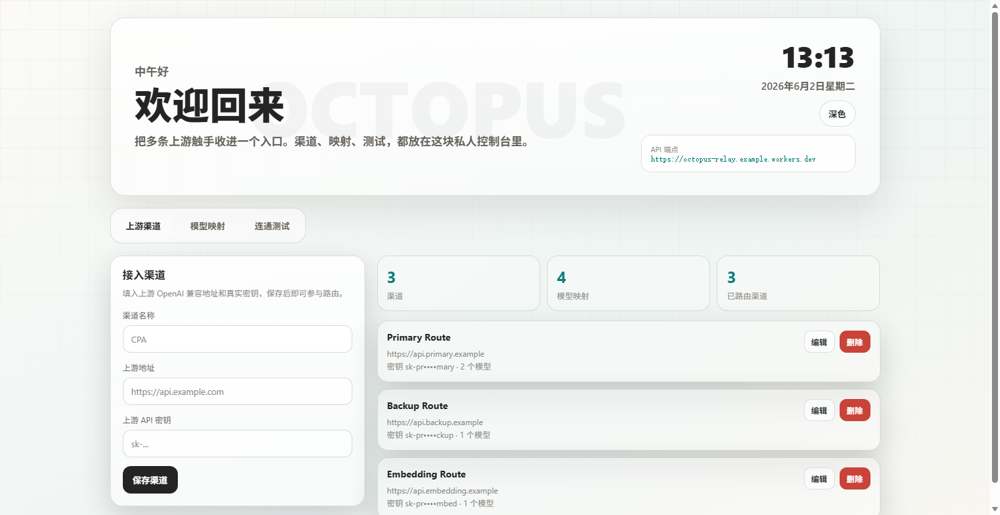

# Octopus Relay - Worker 部署版

这是 Cloudflare Workers 部署版本。目录的 `_worker.js` 更适合 Cloudflare Pages 上传； `worker.js` 可以直接用于 Cloudflare Workers。

## 界面预览

截图使用示例域名和假数据生成，不包含真实密钥或私人渠道。



## 功能

- 多个 OpenAI 兼容上游渠道统一入口
- 自定义模型名映射到真实上游模型
- 内置私人管理控制台
- 支持 `/v1/models` 和 `/v1/chat/completions` 等 OpenAI 兼容路径
- 上游响应流会直接透传，适合聊天工具接入

## 必需配置

需要 1 个 KV 绑定和 2 个环境变量。

KV 绑定：

```text
AI_PROXY_DATA
```

环境变量：

```text
ADMIN_KEY   管理控制台密码
CLIENT_KEY  调用 /v1/* 接口时使用的 API 密钥
```

## Cloudflare 网页面板部署

1. 打开 Cloudflare Dashboard。
2. 进入 Workers & Pages。
3. 创建一个 Worker。
4. 把 `worker.js` 的全部内容复制到 Worker 编辑器。
5. 创建一个 KV namespace，例如 `AI_PROXY_DATA`。
6. 在 Worker 的 Settings 里添加 KV binding：

```text
Variable name: AI_PROXY_DATA
KV namespace: 你创建的 KV
```

7. 在 Variables and Secrets 里添加：

```text
ADMIN_KEY
CLIENT_KEY
```

8. 保存并部署。

部署后访问 Worker 域名即可进入管理控制台。聊天工具里：

```text
API 地址: https://你的-worker域名
API 密钥: CLIENT_KEY 的值
```

## Wrangler 部署

如果使用 Wrangler，可以复制 `wrangler.toml.example` 为 `wrangler.toml`，然后填写自己的 KV namespace id。

安装并登录：

```bash
npm install -g wrangler
wrangler login
```

创建 KV：

```bash
wrangler kv namespace create AI_PROXY_DATA
```

设置密钥：

```bash
wrangler secret put ADMIN_KEY
wrangler secret put CLIENT_KEY
```

部署：

```bash
wrangler deploy
```

## 安全提醒

- 不要把真实的上游 API 密钥写进 GitHub。
- 不要把 `ADMIN_KEY` 和 `CLIENT_KEY` 写进代码。
- 建议使用较长随机字符串作为密钥。
- 这个项目定位是个人使用的小型中转管理工具，不建议直接当公共服务开放。
